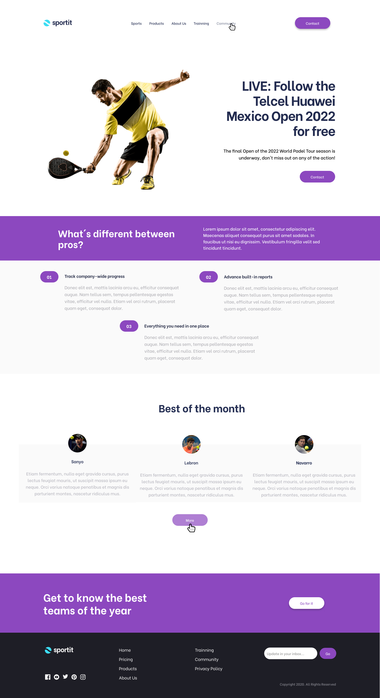
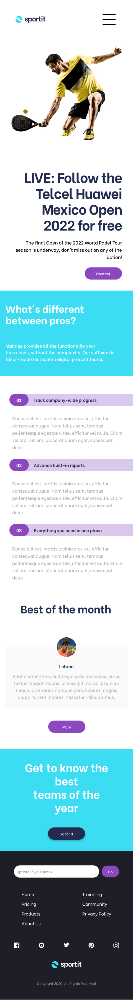

# Maquetado página web "Sportit"
## 1. Resumen del proyecto
Este proyecto busca hacer una página web lo más parecido al diseño entregado. 
Se usa:
- Estrucutra HTML e implementación de etiquetas semánticas.
- Adaptibilidad a dos tipos de dispositivos usando media quieries.
- Uso de formulario.
- Implementación de Flexbox
- Estructuracion CSS con buenas prácticas.
- Pseudoelelmentos.

## 2. Diseños 
Los diseños fueron creados para dos anchos:
- **Mobile** : 480px
- **Desktop** : 1440px
### Diseño desktop y mobile FIGMA
- Ambos diseños se pueden encontrar en el siguiente 
**[link.](https://www.figma.com/file/xWPKOVj3MRZshDsCtlDzMv/Dise%C3%B1o-SPORTIT?node-id=0%3A1&t=mmMiyyRWyzNg8yuf-1)**

### Diseño Desktop (1440px)

### Diseño Mobile (480px)

